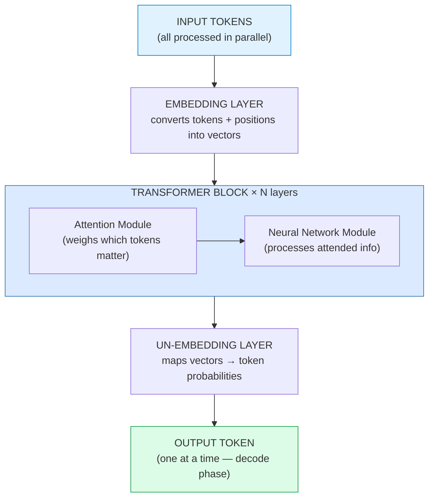
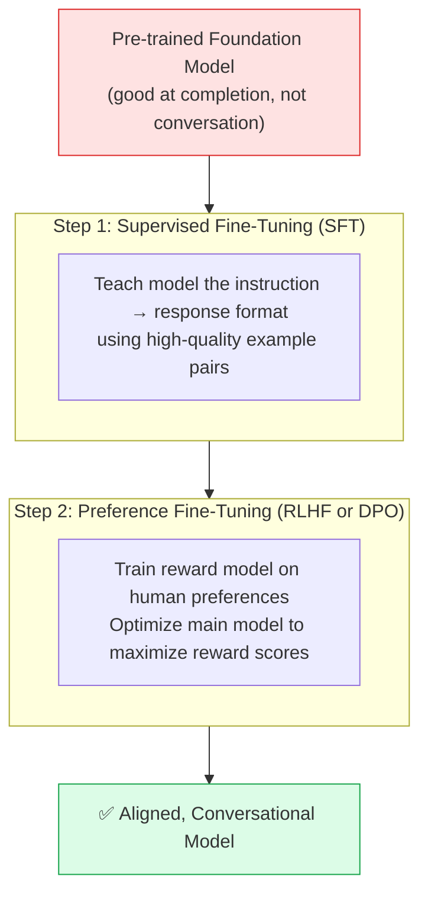
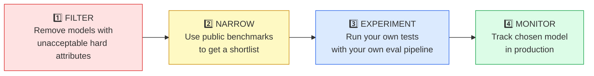
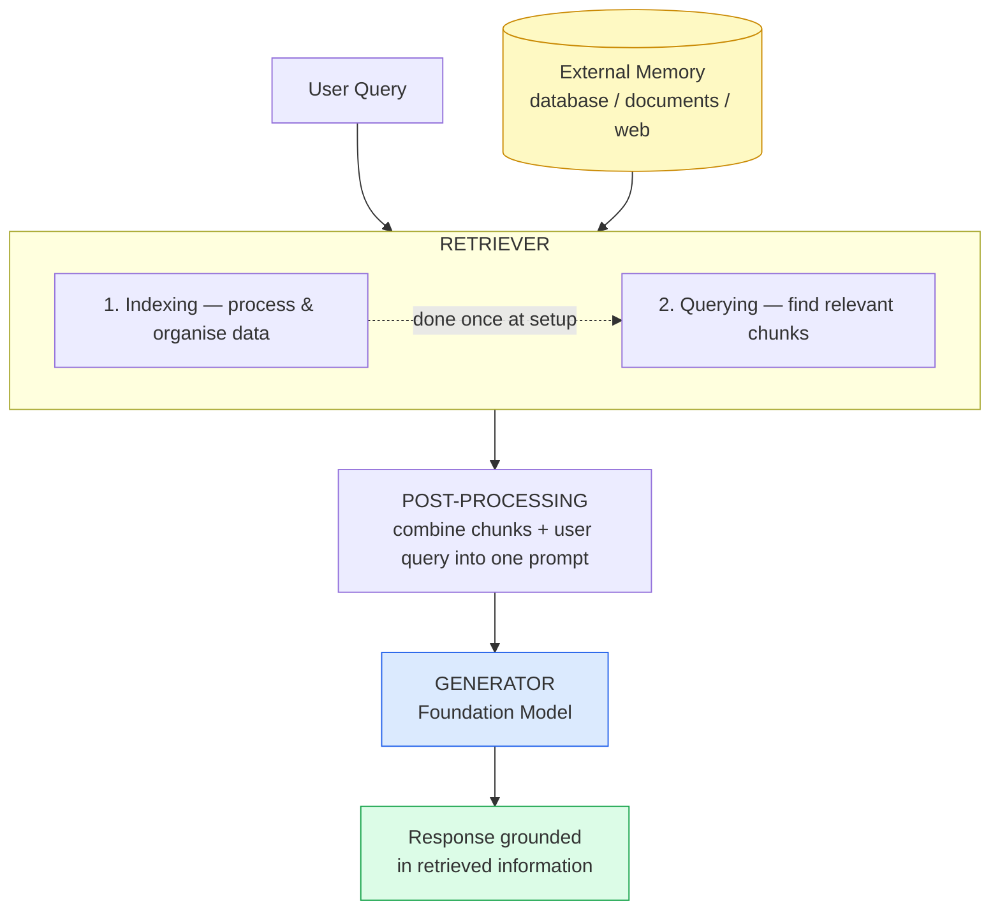
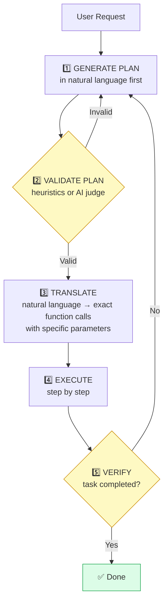
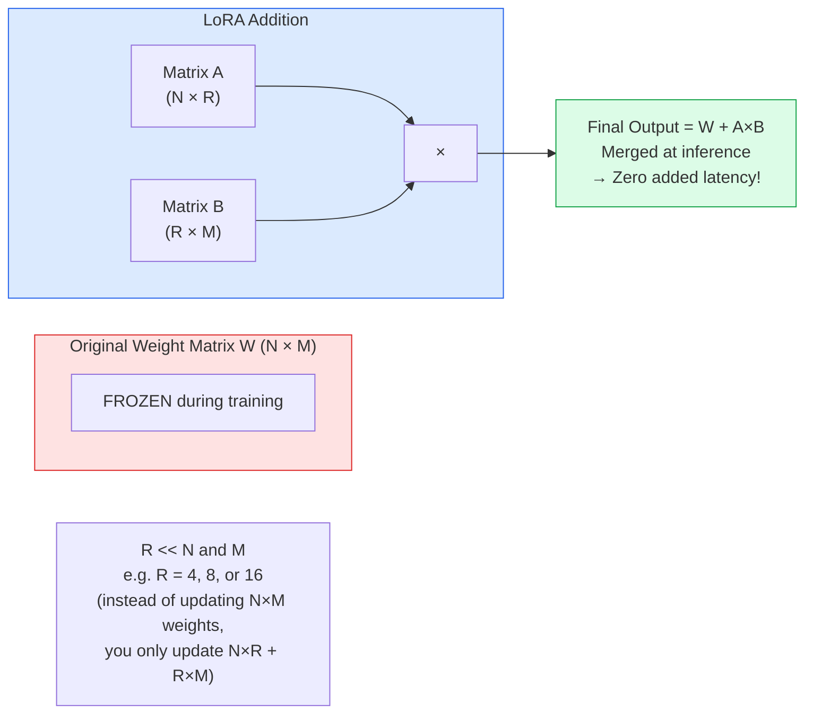
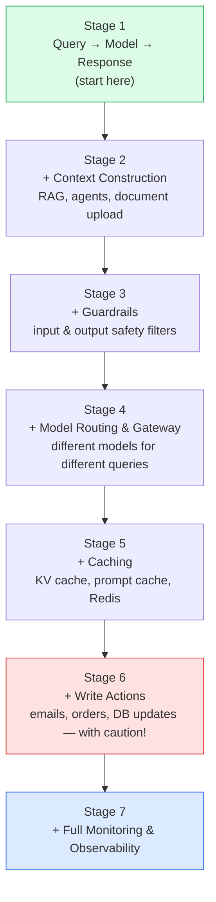

# 🤖 AI Engineering — Study Notes
> Based on **AI Engineering** by Chip Huyen  
> Video summary → full notes with diagrams

---

## 📚 Table of Contents

1. [What is AI Engineering?](#1-what-is-ai-engineering)
2. [Foundation Models & Transformers](#2-foundation-models--transformers)
3. [Evaluation](#3-evaluation)
4. [Model Selection](#4-model-selection)
5. [Prompt Engineering](#5-prompt-engineering)
6. [RAG — Retrieval-Augmented Generation](#6-rag--retrieval-augmented-generation)
7. [Agents & Agentic Patterns](#7-agents--agentic-patterns)
8. [Fine-Tuning](#8-fine-tuning)
9. [Dataset Engineering](#9-dataset-engineering)
10. [Inference Optimization](#10-inference-optimization)
11. [Application Architecture & Feedback](#11-application-architecture--feedback)
12. [Quick Reference Cheat Sheet](#12-quick-reference-cheat-sheet)

---

## 1. What is AI Engineering?

### 1.1 Why it exploded now

Two things happened at the same time:

1. **AI models dramatically improved** at solving real problems
2. **The barrier to building with them dropped** to near zero

This created one of the fastest-growing engineering disciplines today.

### 1.2 What AI Engineers actually do

Unlike traditional ML engineers who **build models from scratch**, AI engineers build applications **on top of** existing Foundation Models. The focus shifts from training to **adaptation**.

| AI Engineer | Traditional ML Engineer |
|---|---|
| Builds on top of existing models | Builds models from scratch |
| Prompt engineering & fine-tuning | Designs architectures & training pipelines |
| Needs stats, engineering, classical ML | Needs deep math & ML theory |
| Works with APIs and open-source models | Trains on large proprietary datasets |

### 1.3 How Foundation Models learn — Self-Supervision

Traditional ML needed humans to label every data point. That was a huge bottleneck. Foundation models solve this differently:

1. **Instead of human-labeled data**, models learn by predicting parts of their own input
   - e.g. predict the next word in a sentence — no human needed to label anything
2. This is called **self-supervised learning**
3. It removed the data labeling bottleneck that held AI back for years

As models scaled with more data + compute, they evolved:

```
Language Models  →  LLMs  →  Large Multimodal Models (text + image + video)
```

> ⚠️ **Important:** Training data is ~50% English. This is why models perform worse on other languages, and why specialized models for specific languages are becoming important.

---

## 2. Foundation Models & Transformers

### 2.1 Transformer Architecture

Before Transformers, models used **Sequence-to-Sequence (Seq2Seq)** architecture with RNNs. It had two main components:

1. **Encoder** — processes the input and compresses it into a fixed-size representation
2. **Decoder** — uses that representation to generate the output

| ❌ Problem (Seq2Seq) | ✅ Solution (Transformer) |
|---|---|
| Decoder only had access to one compressed summary of the entire input — like answering detailed questions from just a one-paragraph book summary | Attention Mechanism: the decoder can now look at **any part of the input at any time** while generating output — like being able to reference any page of the book |
| Input processing was sequential — slow for long sequences | Transformers process input tokens **in parallel** |

#### How a Transformer works — two phases

1. **Pre-fill** — all input tokens are processed in parallel to create the intermediate state
2. **Decode** — output is generated one token at a time *(this is the sequential bottleneck)*



#### The Attention Mechanism — in plain words

Attention uses three vectors for every token. Think of it like a search engine:

1. **Query (Q)** — What is the model looking for? *(the search query)*
2. **Key (K)** — The index/label of each past token *(the search index)*
3. **Value (V)** — The actual content of each past token *(the search result)*

The model compares **Q** against every **K**. A high similarity score means that token's **Value (V)** will heavily influence the output.

> 💡 **Key Insight:** Longer context windows are expensive because there are more K and V vectors to compute and store for every single token generated.

Attention is almost always **multi-headed** — multiple heads run simultaneously, each focusing on different aspects of the input.
- LLaMA 2 (7B model) uses **32 attention heads**

### 2.2 Model Size, Parameters & Scaling

Parameters are the learnable values in the model. **More parameters = more capacity to learn.**

- Parameter count helps estimate compute needed for training and inference
- Larger, **sparse** models (many zero values) can be more efficient than smaller dense ones

#### Chinchilla Scaling Law

Answers the question: *how much data do you need for a given model size?*

> **Rule:** Training tokens ≈ **20×** the number of model parameters  
> **Example:** A 3B parameter model needs ~60B training tokens

#### Two major bottlenecks approaching

1. **Training Data** — we may run out of high-quality internet text in the next few years
   - Models might then train on AI-generated content, risking quality degradation
2. **Electricity** — data centers already use 1–2% of global electricity
   - Hard to scale without major energy breakthroughs

### 2.3 Post-Training — Making Models Useful

Pre-trained models are good at text completion but **not at conversation**, and outputs can be factually wrong or harmful. Post-training fixes both issues in two steps:



### 2.4 Sampling — How Outputs are Generated

Models output a **probability distribution** over possible next tokens. How we sample from this distribution has a huge effect on quality.

| Method | Setting | Effect |
|---|---|---|
| **Greedy** | Always pick top token | Repetitive, predictable — avoid |
| **Temperature** | Low (0.1–0.3) = focused | Controls randomness of outputs |
| | High (0.7–1.0) = creative | More variety, less accuracy |
| **Top-K** | K = 50–500 | Only consider top K most likely tokens |
| **Top-P** | P = 0.9 | Consider tokens summing to 90% of probability mass |

> ⚠️ **Important:** This probabilistic nature explains **hallucinations** (confidently wrong answers) and why the same prompt can give different outputs each run.

---

## 3. Evaluation

Evaluation answers the question: *is my model/system actually working?* For some applications, evaluation can consume the **majority of development effort**.

### 3.1 Why AI Evaluation is Hard

Traditional ML evaluation checks accuracy on labeled data. AI evaluation is much harder for 5 reasons:

1. **Problems are complex** — evaluating a legal summary requires reading the whole document
2. **Tasks are open-ended** — thousands of valid ways to write a poem about resilience
3. **Models are black boxes** — you can only evaluate outputs, not internal reasoning
4. **Benchmarks saturate quickly** — what was hard last year is easy today
5. **Unknown capabilities** — general models may do things beyond what benchmarks test

### 3.2 Core Metrics

#### Perplexity

Measures how **uncertain** the model is when predicting the next token. It is the exponential of cross-entropy.

- **Higher perplexity** = model is more uncertain = more options it's considering
- More structured/predictable text → lower expected perplexity
- Larger vocabulary → higher perplexity (more possible options)
- Longer context → lower perplexity (more information to predict from)

Two interesting secondary uses:
1. **Detect if text was in training data** — model will have unusually low perplexity on memorized data
2. **Detect nonsense text** — nonsense will have abnormally high perplexity

#### Three ways to compare outputs to references

1. **Exact Match** — binary right/wrong. Good for definitive factual questions.
   - e.g. *"Who was the first woman to win a Nobel Prize?"*
2. **Lexical Similarity** — token overlap using BLEU, ROUGE, edit distance
   - ⚠️ Limitation: many ways to say the same thing — high overlap ≠ better response
3. **Semantic Similarity** — compare meaning using embeddings (cosine similarity)
   - ✅ Doesn't need reference data. Depends on embedding model quality.

### 3.3 Using AI as a Judge

Using another AI model to evaluate outputs — fast, cheap, no reference data needed.

- Can judge: correctness, toxicity, hallucinations, format adherence
- Studies show AI judges correlate strongly with human evaluators
- Better at **classification tasks** than giving numerical scores

#### Watch out for these AI judge biases:

1. **Self-bias** — prefers outputs from the same model family
2. **Position bias** — tends to prefer the first response in a comparison
3. **Verbosity bias** — tends to prefer longer responses

*Mitigation: randomize the order of responses being compared.*

### 3.4 Evaluation Best Practices

- ✅ Always tie evaluation metrics to **business metrics**
  - e.g. *90% factual consistency → can automate 50% of support tickets*
- ✅ Evaluate on **different data slices** — not just overall accuracy (avoid Simpson's Paradox)
  - A model can look better overall but be worse on every individual user segment
- ✅ Test your pipeline's **reliability** — run bootstrap samples, expect consistent results
- ✅ Mix cheap automated metrics (100% of data) with expensive AI judges (1% of data)
- ✅ Include human evaluation even in production — just on a small subset

> 💡 **Key Insight:** Your evaluation pipeline itself needs to be evaluated. Ask: *Do better scores actually lead to better business outcomes?* If not, you're measuring the wrong thing.

---

## 4. Model Selection

The challenge today is not **developing** models — it's **selecting** the right one from the many available.

### 4.1 Hard vs. Soft Attributes

Before comparing model quality, filter by what's non-negotiable:

| Hard Attributes *(filter first — can't change)* | Soft Attributes *(can improve via prompting/fine-tuning)* |
|---|---|
| License restrictions | Accuracy |
| Training data composition | Toxicity level |
| Model size (memory budget) | Factual consistency |
| Data privacy requirements | Output format adherence |
| Level of control needed | Instruction following quality |

### 4.2 Self-Hosted vs. Commercial API

| Self-Hosted Open-Weight | Commercial API |
|---|---|
| Full data privacy control | Easy to start — no infrastructure needed |
| No per-call costs at scale | Scalability handled automatically |
| Complete flexibility to fine-tune | Extra features: function calling, guardrails |
| Can deploy on-device | Strongest models stay proprietary |
| You own the infrastructure | Can become expensive at high usage |

> 💡 **Key Insight:** Design your app with a **standard internal API layer** so you can swap models easily. Treat models as plug-and-play components — if the provider changes terms or goes down, you update one layer, not your whole codebase.

### 4.3 Model Selection Workflow



> ⚠️ Watch out for **data contamination** in public benchmarks — models may have been trained on the same data they're being evaluated on, making them look artificially good.

---

## 5. Prompt Engineering

Crafting instructions that guide a model to generate your desired output. The easiest adaptation technique — **it doesn't change the model's weights**.

> ⚠️ **Rule #1:** Always extract maximum value from prompting **before** moving to fine-tuning. Fine-tuning is expensive and complex. Many teams jump to it too early.

### 5.1 Anatomy of a Prompt

A well-structured prompt has three components:

1. **Task description** — the model's role and expected output format
   - e.g. *"You are a helpful medical assistant. Analyse symptoms and suggest conditions in order of likelihood."*
2. **Examples** — show the model what a good response looks like *(few-shot learning)*
   - Each example is called a **"shot"**. Few-shot > zero-shot for most tasks.
3. **Concrete task** — the specific question or job for this particular request

```
System Prompt  =  task description  +  examples   (written by the developer)
User Prompt    =  the concrete task for each individual request
```

### 5.2 Key Strategies

#### 1. Be explicit — remove all ambiguity
Define the scoring system, edge cases, and expected behavior in detail. The more specific, the less room for wrong interpretations.

#### 2. Assign a Persona
*"Respond as an experienced pediatrician"* or *"explain as if to a 10-year-old"* — dramatically changes output style and depth.

#### 3. Provide Examples (Few-Shot)
Examples are more powerful than instructions for style changes. The model mirrors the style of examples you provide.

#### 4. Specify the Output Format
- No preambles — *"Based on this essay I would give it..."* is wasted tokens
- Request specific formats: JSON, Markdown, numbered list, specific section headers
- State what **NOT** to include, not just what to include

#### 5. Break Complex Tasks into Subtasks
Benefits:
- Easier to debug — you can see where it goes wrong
- Can use cheaper models for simpler steps
- Parallelizable — independent subtasks can run simultaneously

#### 6. Chain-of-Thought (CoT) — Give the Model Time to Think
- *"Think this through step by step"* — simple and effective
- Define explicit reasoning steps: *"First analyse themes. Second identify the author's perspective..."*
- **Self-critique:** ask the model to check its own work before giving the final answer

> ⚠️ Trade-off: higher quality but increases latency and token usage (= higher cost)

#### 7. Iterate Systematically
- Version your prompts — treat them like code
- Store prompts in config files, **not** hardcoded in the application
- Note: GPT-4 performs best with task description at the **beginning**. LLaMA 3 performs best with it at the **end**.

### 5.3 Prompt Attacks — What to Defend Against

1. **Prompt Extraction** — attacker tries to steal your system prompt to replicate your application
2. **Jailbreaking / Prompt Injection** — attacker tries to override safety guardrails
3. **Information Extraction** — attacker tries to get the model to reveal sensitive training data

**Key defences:**
- Repeat the system prompt before **and** after user input
- Use anomaly detection on inputs
- Define explicit out-of-scope topics
- Run code only in sandboxed environments

> 💡 Track **both** the violation rate (attacks that succeed) **AND** the false refusal rate (legitimate requests wrongly blocked). These two metrics must be balanced.

---

## 6. RAG — Retrieval-Augmented Generation

A model can only know what it was trained on. RAG solves this by letting the model **retrieve relevant information** from external sources before generating its response.

Think of RAG as **context construction** — building the perfect prompt context specifically for each query.



### 6.1 Retrieval — How it Works

The retriever has two jobs:
1. **Indexing** — process and organise your data so it can be quickly searched *(done once at setup)*
2. **Querying** — given a user query, find the most relevant data chunks

Documents are split into smaller **chunks** first — full documents are too long for the context window and contain too much irrelevant information.

#### Two types of retrieval:

1. **Term-Based (Lexical)** — matches keywords using algorithms like TF-IDF
   - ✅ Fast, works with existing tools like ElasticSearch
   - ❌ Problem: misses semantic meaning — *"car"* and *"automobile"* are unrelated to it

2. **Embedding-Based (Semantic)** — converts text to vectors and compares meaning
   - ✅ Significantly better quality, finds conceptually similar content
   - ❌ Slower and more expensive. Can miss exact names or error codes.

> 💡 **Production systems combine both:** term-based retrieval fetches a broad set of candidates cheaply, then embedding-based search re-ranks those candidates precisely.

### 6.2 Key RAG Improvement Techniques

#### Chunking strategy
- **Smaller chunks** = more diverse retrieval but less context per chunk
- **Overlapping chunks** — ensure boundary information isn't lost between chunks
- **Chunk augmentation** — add metadata (tags, keywords, document summary) to each chunk
- ⚠️ No universal best chunk size — experiment based on your data

#### Re-ranking
Initial retrieval rankings can be refined using additional signals like recency or domain-specific relevance scores.

#### Query Rewriting
User queries often lack context. Rewriting expands them before retrieval.
> **Example:** *"What's its population?"* → *"What's the population of Paris?"* (using conversation history)

> 💡 RAG works beyond text: **multimodal RAG** can retrieve relevant images, and **tabular RAG** can run SQL queries on databases before generating a response.

---

## 7. Agents & Agentic Patterns

An agent can **perceive its environment, make decisions, take actions, and learn from outcomes**.

What makes agents more powerful than plain RAG: they can **actively go out and gather information** rather than passively relying on a fixed database.

### 7.1 Types of Tools Agents Can Use

1. **Knowledge augmentation** — RAG retrievers, web search, SQL executors, APIs, email readers
   - Let the agent access information it doesn't have internally
2. **Capability extension** — calculators, code interpreters, unit converters, translation
   - Compensate for things models are bad at, like precise arithmetic
3. **Write / Action tools** — send emails, place orders, update databases, initiate transfers
   - Let the agent **change the real world** — most powerful and most risky

> ⚠️ **Important:** Write actions dramatically increase capability but also introduce serious risks. Always require **human approval** for high-impact irreversible actions.

### 7.2 Planning

Complex tasks require planning — deciding which tools to use and in what order. Key principle: **decouple planning from execution** so you can validate a plan before running it.



> 💡 **Tip:** Always ask the agent to report what parameter values it uses for each function call. This catches many bugs before execution.

### 7.3 Memory in Agents

Agents need to remember information across multiple steps and sometimes across sessions:

| Memory Type | Characteristic | Use When |
|---|---|---|
| **Internal Knowledge** | Embedded during training, always available but static | Essential-to-all-tasks info |
| **Context Window** | Short-term, current session only, limited by size | Session-specific info |
| **External Storage (RAG)** | Long-term, stored in databases, retrieved as needed | Rarely-needed info |

---

## 8. Fine-Tuning

Fine-tuning adapts a model to a specific task by **further training it and updating its weights**. Unlike prompting, it permanently changes what the model knows and how it behaves.

### 8.1 When to Fine-Tune (and When NOT to)

Fine-tuning can improve a model in two ways:
1. **Domain-specific capabilities** — e.g. coding, answering medical questions
2. **Instruction-following abilities** — e.g. always returning JSON, specific output structure

| ✅ Fine-Tune When... | ❌ Don't Fine-Tune When... |
|---|---|
| You've exhausted prompt engineering | You're still in early experimentation |
| Need consistent structured output format | You need a general-purpose model |
| Smaller model needs to match larger one | You haven't tried RAG yet for info gaps |
| Distilling a large model into a small one | You don't have enough quality training data |

### 8.2 Fine-Tuning vs. RAG — Choosing the Right Tool

| ❌ Information Failure | ❌ Behaviour Failure |
|---|---|
| Model gives wrong answers because it **lacks knowledge** (private data, recent events) | Model has the right info but **outputs it wrong** (wrong format, tone, structure) |
| **→ Use RAG first** (easier, faster) | **→ Use Fine-Tuning** |

> 💡 **Both?** RAG + Fine-Tuning combined gives the biggest performance boost.

### 8.3 Memory — Why it's the Key Challenge

Fine-tuning needs both a **forward pass AND backward pass** (backpropagation). The key memory contributors are:

1. Total number of parameters
2. Number of **trainable** parameters — the more trainable, the more memory needed
3. **Numerical precision** — 32-bit needs 2× more memory than 16-bit

**Memory example — 13B parameter model:**

| Precision | Memory Required |
|---|---|
| 32-bit | 52 GB |
| 16-bit | 26 GB |
| 8-bit | 13 GB |

### 8.4 Parameter-Efficient Fine-Tuning (PEFT)

Full fine-tuning updates all parameters — very expensive. **PEFT** inserts small trainable modules while keeping original weights frozen. Works with far less data and memory.

#### LoRA — Low-Rank Adaptation *(most popular PEFT method)*

The problem it solves: *how do we fine-tune effectively without updating millions of parameters?*

**LoRA's insight:** the weight changes needed during fine-tuning have low intrinsic rank — they can be represented as two small matrices multiplied together.



> 💡 LoRA adapters can be **merged back** into the original model for deployment — you get the benefits of fine-tuning without any added inference latency.

### 8.5 Key Hyperparameters

| Hyperparameter | Problem if Wrong | Tip |
|---|---|---|
| **Learning Rate** | Too high → loss fluctuates. Too low → learns very slowly. | Start high, decrease over time |
| **Batch Size** | Too small → unstable training | Larger = faster but needs more memory |
| **Epochs** | Too many → overfitting | Smaller datasets: 4–10. Millions of examples: 1–2. |
| **Prompt Loss Weight** | 0% = learns only from responses | Default 10%. 100% = prompt and response equal weight. |

---

## 9. Dataset Engineering

A shift is happening in AI development:

```
Model-Centric AI  →  Data-Centric AI
(improve the model)    (improve the data)
```

For companies adapting foundation models, **data quality is the biggest competitive differentiator**.

> 💡 A small, high-quality dataset almost always outperforms a large, noisy one. **Garbage in, garbage out.**

### 9.1 What Makes Data High Quality?

1. **Relevance** — examples must match your actual target task, not just the same domain
2. **Alignment** — data must exhibit the exact behaviours you want (e.g. CoT reasoning, specific format)
3. **Consistency** — same quality standards applied across all examples AND all annotators
4. **Coverage** — enough diversity to handle all the problem types your users will encounter
5. **Uniqueness** — minimal duplicates (duplicates cause over-representation of certain patterns)
6. **Compliance** — no PII, toxic content, or copyrighted material

### 9.2 How Much Data Do You Need?

| Factor | Impact |
|---|---|
| Fine-tuning method | Full fine-tuning: thousands–millions. LoRA: hundreds–few thousand. |
| Task complexity | Sentiment classification << Complex financial Q&A |
| Base model quality | Stronger base model = fewer examples needed |

**Practical rule:**
> Start with **50–100 carefully crafted examples**. If you see improvement → more data will help. If no improvement with 50 good examples → the problem is **not** data volume.

### 9.3 Where to Get Data

1. **Data flywheel** — use real user interactions to continuously improve your model *(compounding competitive moat)*
2. **Existing datasets** — mix and match from public sources, verify licensing
3. **Human annotation** — expensive but high quality. Critical challenge: writing clear annotation guidelines.
4. **Data augmentation** — derive new examples from existing ones (e.g. flip/rotate images, paraphrase text)
5. **Data synthesis** — generate artificial data using AI *(especially useful for sensitive/private domains)*

### 9.4 Data Processing Checklist

- [ ] Test filtering scripts on small samples before running on everything
- [ ] Never modify originals — always keep raw copies
- [ ] Explore distributions and outliers (EDA) before training
- [ ] Check inter-annotator agreement — disagreements reveal ambiguous guidelines
- [ ] Deduplicate — remove near-identical examples
- [ ] Remove PII, toxic content, copyright violations
- [ ] Clean HTML/Markdown formatting tokens (add noise and increase input size)
- [ ] Apply the correct tokenizer and chat template for your specific model

---

## 10. Inference Optimization

A model's real-world usefulness comes down to: **how much it costs to run** and **how fast it responds**.

### 10.1 Two Types of Bottlenecks

Before optimising, know what's slowing you down:

1. **Compute-bound** — limiting factor is raw processing power
   - Common in image generation. Needs more powerful chips.
2. **Memory bandwidth-bound** — limiting factor is how fast data moves between memory and processor
   - **LLM inference is almost always memory bandwidth-bound**. Needs higher bandwidth chips.

> 💡 Knowing your bottleneck type is critical — the wrong optimization technique will have zero effect. Profile first.

### 10.2 Key Performance Metrics

1. **Time to First Token (TTFT)** — how quickly the first response token appears
   - Critical for chat apps — users perceive this as how "responsive" the system feels
2. **Time Per Output Token (TPOT)** — speed of each subsequent token
3. **Total Latency** = `TTFT + (TPOT × number of output tokens)`
4. **Throughput** — total tokens per second across all requests (higher = lower cost)

> ⚠️ There is a fundamental **latency-throughput trade-off**. Batching improves throughput but increases individual request latency. Your strategy must reflect your application's priorities.

### 10.3 Model-Level Optimisations

#### Quantisation *(most impactful, easiest to implement)*

Reduce the numerical precision of model weights:

| From | To | Memory Reduction |
|---|---|---|
| 32-bit | 16-bit | 2× smaller |
| 16-bit | 8-bit | 2× smaller |
| 8-bit | 4-bit | 2× smaller (some quality loss) |

> ⚠️ Always load a model in the precision it was designed for. LLaMA 2 was designed for `bf16` — loading in `fp16` causes significant quality degradation.

#### Speculative Decoding

Solves the sequential bottleneck of autoregressive generation:

1. A **small fast "draft" model** generates several candidate tokens cheaply
2. The **large target model** verifies all candidates in one parallel pass
3. Accepted tokens are kept, rejected ones are resampled

Net effect: the large model generates more tokens per step, reducing total steps needed.

### 10.4 Service-Level Optimisations

#### Batching — combining multiple requests

1. **Static batching** — fixed batch size. Simple but can cause inconsistent latency.
2. **Dynamic batching** — process batch when full or time limit reached. More consistent.
3. **Continuous batching** — return results as soon as ready, immediately add new requests. *(Best user experience)*

#### Caching

- **KV Cache** — cache the Key and Value attention vectors so they don't need recomputing
  - Fundamental to almost all LLM inference. Massively reduces compute for long contexts.
- **Prompt Cache** — avoid reprocessing identical system prompts or reference documents
  - Especially valuable for long system prompts or document-based Q&A

### 10.5 Hardware Parallelism

When a single GPU isn't enough:

| Strategy | How | Best For |
|---|---|---|
| **Replica Parallelism** | Multiple identical copies, each serving different requests | High throughput. Simple to implement. |
| **Tensor Parallelism** | Split matrix operations across GPUs | Low latency. All GPUs collaborate on each request. |
| **Pipeline Parallelism** | Different model layers on different GPUs | Models that don't fit on one GPU |

> 💡 **Recommended order:** quantisation → KV caching → continuous batching → tensor parallelism

---

## 11. Application Architecture & Feedback

Real-world AI applications evolve in stages. Key principle: **only add complexity when it solves a real problem you're facing**.

### 11.1 How Architecture Evolves



### 11.2 Model Router & Gateway

As your application matures, a single model may not suit all query types:

1. **Intent classifier** — fast, cheap classifier predicts what the user is trying to do
2. **Route to appropriate model** — complex queries → strong (expensive) model; simple → cheap fast model

The **model gateway** sits between your app and all your models, providing:
- Unified interface — one endpoint regardless of which model is used
- Access control and cost management
- Fallback policies — if one model fails, automatically switch to another
- Logging and analytics

### 11.3 Monitoring vs. Observability

| Monitoring | Observability |
|---|---|
| Tracks external outputs | Tracks internal system state |
| Tells you **THAT** something broke | Tells you **WHY** something broke |
| Like knowing your car broke down | Like having sensors showing which part failed |

**Three metrics to track:**
- **MTTD** — Mean Time to Detect an issue
- **MTTR** — Mean Time to Resolve
- **CFR** — Change Failure Rate (% of deployments that cause failures)

> 💡 **Golden rule: log everything.** When something goes wrong, detailed logs let you diagnose without deploying new code.

### 11.4 User Feedback — Your Competitive Moat

Everyone has access to the same foundation models. The one thing you have that competitors don't: **how your specific users interact with your specific system.**

| Explicit Feedback *(user provides directly)* | Implicit Feedback *(inferred from behaviour)* |
|---|---|
| Thumbs up / down | Early conversation termination |
| Star ratings | Frequency of regenerating responses |
| Written comments | Complaint-tone messages |
| Explicit corrections | Conversation length |

> 💡 **Data flywheel:** user interactions → more training data → better model → better product → more users → more interactions. This virtuous cycle is what separates good AI products from great ones.

### 11.5 Orchestration Tools

| Tool | Best For |
|---|---|
| **LangChain** | Popular, highly flexible, large community |
| **LlamaIndex** | RAG-heavy pipelines |
| **Haystack** | Search-heavy applications |
| **LangFlow / Flowise** | Visual, low-code orchestration |

> ⚠️ **Pro Tip:** Start **without** an orchestrator. Understand the core mechanics of your system first, then add orchestration once genuine complexity demands it. Adding abstraction too early makes debugging harder.

---

## 12. Quick Reference Cheat Sheet

### When to Use What

| Situation | Recommended Approach |
|---|---|
| Starting a new project | Always start with **prompt engineering** |
| Model lacks information | **RAG** — start with term-based, add embedding-based if needed |
| Wrong output behaviour/format | **Fine-Tuning** (LoRA if data is limited) |
| Both information + behaviour issues | **RAG + Fine-Tuning** combined |
| Need a cheap model fast | **Distill** a large model into a small fine-tuned one |
| Slow inference | **Quantisation → KV cache → batching** (in that order) |
| High inference cost | Smaller model + quantisation + prompt caching |
| Testing fine-tune code | Use the **smallest/cheapest model first** to verify code works |
| Eval giving inconsistent results | Bootstrap sample your eval set — if scores vary widely, pipeline is untrustworthy |

### The 7 Golden Rules of AI Engineering

1. ⚡ Always try **prompt engineering before fine-tuning** — it's 10× faster to iterate
2. 🎯 A **small, clean dataset** beats a large, noisy one every time
3. 📊 Always tie **evaluation metrics to real business outcomes**
4. 🔍 **Log everything** — you can't debug what you can't observe
5. 🔄 **Design to swap models easily** — today's best model is next year's mediocre one
6. 🧱 **Complexity should earn its place** — only add it when it solves a real problem
7. 🌀 Your users' **interaction data is your most valuable asset** — build a flywheel

---

*Notes compiled from the AI Engineering book by Chip Huyen. For deeper understanding, read the original book.*
