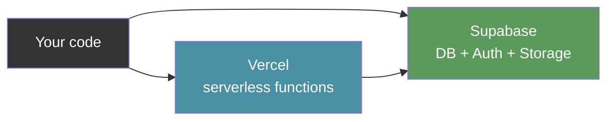

# The Vibe Coder's Stack

> *The tools that let you ship instead of yak-shave. Each pick is popular (agents know it), battle-tested, and removes an entire category of pain.*


---

## At a Glance

| # | Category | Pick | One-liner |
|:---:|---|---|---|
| 1 | Database | **Prisma + Postgres** | Type-safe queries, no raw SQL |
| 2 | Backend | **Serverless + BaaS** | Scale later, survive now |
| 3 | Secrets | **env + dotenv** | Hardcoding = instant regret |
| 4 | Folders | **Modularize early** | Refactors cost 10x later |
| 5 | Docs | **Write your README now** | Your memory will betray you |
| 6 | UI | **shadcn/ui or Radix** | Consistency beats creativity at MVP |
| 7 | Forms | **React Hook Form + Zod** | Validation bugs will haunt you |
| 8 | Uploads | **UploadThing or Cloudinary** | Multipart hell is real |
| 9 | Payments | **Stripe or Polar** | Never touch PCI compliance |
| 10 | Search | **Algolia or Typesense** | It's harder than it looks |
| 11 | Onboarding | **Empty states** | UX beats features every time |
| 12 | CI/CD | **GitHub Actions** | Future-you will thank you |
| 13 | Errors | **Sentry or LogRocket** | console.log isn't observability |
| 14 | Analytics | **PostHog or Plausible** | You're flying blind otherwise |
| 15 | Performance | **Lighthouse + Vercel** | Slow apps don't convert |

---

### 1. Database — Prisma + Postgres

Postgres is the database. Prisma lets you talk to it using TypeScript instead of raw SQL — where one typo silently deletes everything.

> [!question] Why not raw SQL?
> Prisma's `schema.prisma` file is extremely readable for both humans and agents. When your agent can see the schema, it generates correct queries on the first try. Raw SQL means the agent guesses at your table structure.

| | Prisma | Raw SQL |
|---|---|---|
| Type safety | Full TypeScript types auto-generated | None |
| Migrations | `npx prisma migrate dev` | Manual scripts |
| Agent accuracy | High — schema is clear context | Low — guesses table structure |
| Inspect data | `npx prisma studio` (GUI) | CLI only |

**Agent file:**
```
Database: Prisma + Postgres. Use `npx prisma studio` to inspect data.
Run `npx prisma migrate dev` after schema changes. Load DB URL from .env.
```

---

### 2. Backend — Serverless + BaaS First

BaaS = Backend as a Service (Supabase, Firebase). Instead of setting up your own server, you rent one that scales automatically. "Serverless" just means someone else manages the server.

> [!tip] Start here, migrate later
> This aligns with the [[The Vibe Coding Playbook#Recommended Stack (Web)|recommended stack]] — Supabase for database and auth, Vercel for serverless functions. Build the custom infra only when you have a reason.



**Agent file:**
```
Backend: Next.js API routes (serverless on Vercel) + Supabase for DB/auth/storage.
No custom server unless explicitly discussed.
```

---

### 3. Config and Secrets — env + dotenv

Your app needs secrets: API keys, database passwords, etc. You never hardcode these in your code. `dotenv` loads them from a file that stays off the internet.

> [!danger] Non-negotiable
> Secrets in frontend code is one of the 7 critical vulnerabilities in [[The Vibe Coding Playbook#Part 9 Security Best Practices]]. Always keep `.env` in `.gitignore`. Your agent should never commit secrets.

**Agent file:**
```
Secrets: All secrets in .env.local (never .env). Always in .gitignore.
Access via process.env. Never import secrets in client components.
```

---

### 4. Folder Structure — Modularize Early

Don't dump everything in one file. Group related code together from the start. If you wait until the app is big, untangling it takes ten times as long.

> [!tip] Clean code = clean context
> A well-organized codebase is also better context for your agent — see [[The Vibe Coding Playbook#Keep Your Codebase AI-Friendly]]. The code itself is context, and messy code is noisy context.

```
src/
├── app/              # Routes and pages
├── components/
│   ├── ui/           # shadcn/ui primitives
│   └── features/     # Feature-specific components
├── lib/
│   ├── validations/  # Zod schemas
│   ├── utils/        # Shared utilities
│   └── db/           # Prisma client and queries
├── hooks/            # Custom React hooks
├── types/            # TypeScript type definitions
└── config/           # App configuration
```

---

### 5. Documentation — Write Your README Now

A README explains what your project is and how to run it. Write it while you remember. Come back in three months and you will have no idea what your own code does.

Your [[The Vibe Coding Playbook#The CLAUDE.md / AGENTS.md Standard|CLAUDE.md / AGENTS.md]] is essentially a README for your AI. If a human can't understand the project from the docs, neither can the agent.

---

# Day 2 — Build the UI

> *Get something on screen. Use components that already work so you can focus on what makes your app unique.*

---

### 6. UI Components — shadcn/ui or Radix

Pre-built components (buttons, modals, dropdowns) that look good and work correctly out of the box. Instead of spending a day making a dropdown accessible, you install one that already is.

| | shadcn/ui | Radix |
|---|---|---|
| What it is | Copy-paste components (Radix + Tailwind) | Unstyled accessibility primitives |
| Customization | You own the code, full control | Add your own CSS from scratch |
| Agent familiarity | Extremely high — all over training data | High |
| Best for | Most projects — fast and polished | When you need a custom design system |

> [!tip] Agent-friendly by design
> shadcn/ui is extremely well-known to AI models. Agents generate correct components on the first try because the library is everywhere in training data. This is the [[The Vibe Coding Playbook#Part 1 Define Your Vision Before You Touch Code|"pick popular tools"]] principle in action.

**Agent file:**
```
UI: shadcn/ui + Tailwind. Shared primitives in components/ui/.
Install new components with `npx shadcn@latest add <component>`.
```

---

### 7. Forms — React Hook Form + Zod

Forms seem easy until someone types their age as "banana." React Hook Form manages form state. Zod validates the data. Together they handle the boring validation logic.

> [!warning] Common AI mistake
> Agents love to build forms with raw `useState` for every field. Always specify "use React Hook Form + Zod" in your prompt. Add this to your [[Agent Instructions#Common Mistakes File Template|mistakes.md]] if the agent keeps doing it.

**Agent file:**
```
Forms: Always use React Hook Form + Zod for validation.
Never use raw useState for form fields. Define Zod schemas in lib/validations/.
```

---

### 8. File Uploads — UploadThing or Cloudinary

Handling file uploads yourself means dealing with multipart form data, storage limits, file type validation, and slow servers. These services handle all of that. You get a URL back, you store the URL.

| | UploadThing | Cloudinary |
|---|---|---|
| Best for | Next.js apps, type-safe uploads | Image/video heavy apps |
| Transforms | No | Resize, crop, optimize on the fly |
| Complexity | Simple — built for Next.js | More powerful, more config |

**Agent file:**
```
Uploads: UploadThing for file uploads. Store returned URLs in the database.
Never write files to the local filesystem in production.
```

---

# Day 3 — Add Features

> *The things that make your app actually useful. Each of these is a rabbit hole — use a service instead of building it yourself.*

---

### 9. Payments — Stripe or Polar

PCI compliance is a set of legal and security rules you must follow if you store card details. It's a nightmare. Stripe handles all of it — you never touch actual card numbers.

> [!danger] Never roll your own
> Do not let your agent build a custom payment flow. Do not store card numbers. Do not pass Go. Use Stripe's hosted checkout or embedded components.

| | Stripe | Polar |
|---|---|---|
| Best for | Any payment flow | Creator/SaaS subscriptions |
| Complexity | More setup, more flexibility | Simpler, more opinionated |
| Global | Yes — 135+ currencies | Growing |

**Agent file:**
```
Payments: Stripe. Use Stripe Checkout for payments. Never store card data.
Webhook handler in app/api/webhooks/stripe/route.ts. Verify webhook signatures.
```

---

### 10. Search — Algolia or Typesense

Building a search bar sounds easy. It is not. Typos, speed, ranking results by relevance — all hard.

| | Algolia | Typesense |
|---|---|---|
| Hosting | Cloud (managed) | Self-host or cloud |
| Free tier | Generous | Unlimited (self-host) |
| Vendor lock-in | Yes | No — open source |
| Best for | Fast setup, great docs | Full control, no lock-in |

**Agent file:**
```
Search: Use Algolia/Typesense. Do not build custom search with SQL LIKE queries.
```

---

### 11. Onboarding — Empty States

When a new user opens your app and there's no data yet, show something helpful instead of a blank screen. Small thing, huge impact on whether people stick around.

> [!warning] Agents always forget this
> Add to your [[Agent Instructions#Common Mistakes File Template|mistakes.md]]:
> `- [ ] Missing empty states for lists and data views`
> 
> Without the prompt, agents build the happy path and leave new users staring at nothing.

> [!example] Good empty state
> *"You haven't added any tasks yet — create one here."*
> Include an icon, a short explanation, and a clear call-to-action button. Not just blank space.

---

# Day 4 — Ship with Confidence

> *The difference between a demo and a product. You don't need all of these on day one, but you need them before real users show up.*

---

### 12. CI/CD — GitHub Actions + Preview Deploys

Every time you push to GitHub, Actions automatically runs your tests and deploys a preview link. Future-you will not remember why you changed that one line.

> [!tip] Pairs with atomic commits
> Small, scoped commits make CI failures easy to diagnose. A commit that touches 50 files and breaks CI is a nightmare. See [[The Vibe Coding Playbook#Atomic Commits]].

**Agent file:**
```
CI: GitHub Actions runs tests on push. Vercel auto-deploys preview on PR.
Always ensure tests pass locally before pushing.
```

---

### 13. Error Tracking — Sentry or LogRocket

`console.log` only helps if you're watching. These tools record crashes automatically — even when you're asleep.

| | Sentry | LogRocket |
|---|---|---|
| Core feature | Error tracking + stack traces | Session replay + errors |
| Shows you | *What* broke (with source maps) | *What the user was doing* when it broke |
| Best for | All projects (start here) | UX-heavy apps, debugging flows |

**Agent file:**
```
Errors: Sentry for error tracking. Wrap API routes with Sentry.
Use Sentry.captureException() for caught errors. Never swallow errors silently.
```

---

### 14. Analytics — PostHog or Plausible

You want to know if anyone is actually using your app. Google Analytics is bloated and privacy-invasive.

| | PostHog | Plausible |
|---|---|---|
| What it does | Product analytics, feature flags, A/B tests, session replay | Page-level traffic analytics |
| Complexity | Full platform — more to learn | Dead simple |
| Privacy | Self-hostable, GDPR-friendly | Privacy-first, no cookies |
| Best for | "Which features get used?" | "How many visitors today?" |

> [!example] Pick one
> **PostHog** if you want to track feature usage and run experiments. **Plausible** if you just want traffic numbers without the complexity.

---

### 15. Performance — Lighthouse + Vercel Analytics

Lighthouse (built into Chrome) scores your app on speed, accessibility, and SEO. Vercel Analytics shows real-world load times from actual users. Slow apps get abandoned.

**Agent file:**
```
Performance: Target Lighthouse score 90+. Use next/image for images.
Lazy load below-fold components. Check bundle size before adding dependencies.
```

---

# Copy to Your Agent File

All 15 tools condensed into a single block you can paste into the CLI Tools section of your `AGENTS.md`:

```markdown
## Tools and Services
- Database: Prisma + Postgres. `npx prisma studio` to inspect. `npx prisma migrate dev` after schema changes
- Backend: Next.js API routes on Vercel + Supabase for DB/auth/storage
- Secrets: All in .env.local, always in .gitignore, never in client components
- UI: shadcn/ui + Tailwind. Install with `npx shadcn@latest add <component>`
- Forms: React Hook Form + Zod. Schemas in lib/validations/. Never raw useState
- Uploads: UploadThing. Store URLs in DB, never write to local filesystem
- Payments: Stripe Checkout. Webhook at app/api/webhooks/stripe/route.ts
- Search: Algolia. Never build custom search with SQL LIKE
- CI: GitHub Actions on push. Vercel preview deploys on PR
- Errors: Sentry. Use captureException() for caught errors
- Performance: Lighthouse 90+ target. Use next/image. Lazy load below-fold
```

> [!tip] Context engineering in action
> This entire block is 11 lines. One line per tool. Minimum tokens, maximum signal. See [[The Vibe Coding Playbook#Part 2 Context Engineering — The Most Important Skill]].
