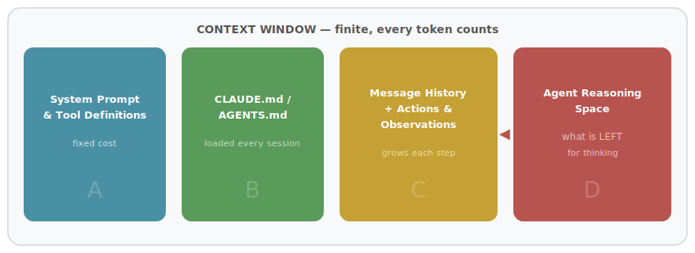
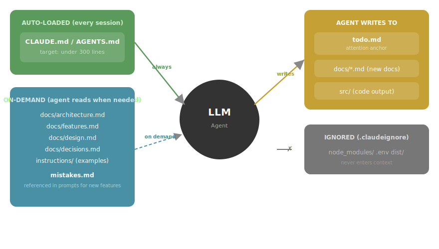
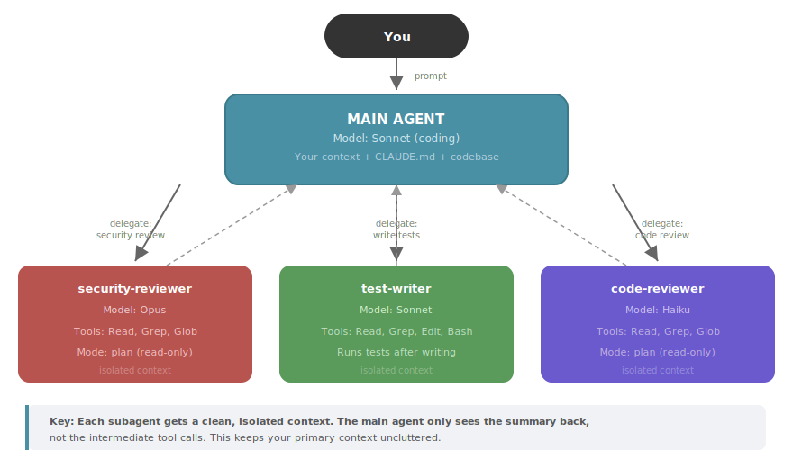
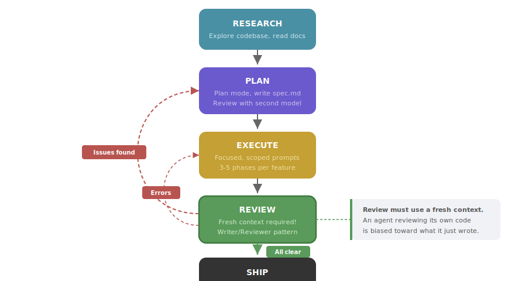

# The Vibe Coding Playbook (March 2026)

A practical guide to getting the best results from AI-assisted development — whether you're building iOS, Android, web apps, or anything in between.

---

## Part 1: Define Your Vision Before You Touch Code

Start with a strong, detailed vision of what you want to build and how it should work. If your input is vague, the output will be too. **Garbage in, garbage out.**

Take time to think through your idea from both a product and user perspective. Use planning tools like Gemini 2.5 Pro in Google AI Studio to help structure your thoughts, outline product goals, and map out how to bring your vision to life.

Before you start building, invest time in these foundational decisions:

- **System design.** Will you communicate via WebSockets? REST? GraphQL? What belongs on the server vs. the client? How and which data flows where?
- **Language and ecosystem.** This is one of the most important decisions. Pick something with strong community support — AI models perform better with popular stacks because they've seen more training data for them.
- **Dependencies and frameworks.** Is the library well-maintained? How about peer dependencies? Is it popular enough that agents will have world knowledge about it? The more common the stack, the better the AI can help.
- **Database schema.** Think forward. A well-designed schema saves enormous refactoring pain later.

These architectural decisions are harder to explain to a model and are where your own research and thinking pays off the most.

### Recommended Stack (Web)

If you're doing web development, a solid beginner-friendly combo:

- **Next.js** — frontend and APIs
- **Supabase** — database and authentication
- **Tailwind CSS** — styling
- **Vercel** — hosting

This removes a lot of boilerplate and manual setup. But adapt to your platform — the principle is: pick popular, well-documented tools.

### Set Realistic Expectations

AI tools provide real productivity gains, but be honest about the magnitude. AI excels at specific tasks — writing one-off scripts, generating boilerplate, handling repetitive patterns — but these represent a fraction of engineering work. Realistic improvements are in the range of 20–30% for specific contexts, not the 10x claims you see in marketing. Most engineering time is spent thinking, debugging, reviewing, and coordinating, none of which AI fundamentally accelerates.

Use AI where it genuinely helps, but maintain confidence in your own skills for complex problem-solving, system design, and the creative aspects of engineering. The core skills of software engineering — problem decomposition, algorithmic thinking, and system design — remain essential for those who want to lead in an AI-augmented future.

---

## Part 2: Context Engineering — The Most Important Skill

Context engineering has replaced prompt engineering as the key discipline for AI-assisted development. It's the practice of deciding what information an AI model sees, when it sees it, and how it's structured.

### Core Principles

**Context is a finite resource.** As the number of tokens in the context window increases, the model's ability to recall and reason accurately decreases (known as "context rot"). Every token you add depletes an "attention budget." Thoughtful curation beats volume every time.

**The smallest possible set of high-signal tokens.** Good context engineering means finding the minimum set of information that maximizes the likelihood of getting what you want. This applies to everything: system prompts, tool definitions, message history, and retrieved data.

Here's what's competing for space inside your agent's context window:



> **The key insight:** Sections A, B, and C are mostly fixed or growing. Section D — the space the model has to actually *think* — is whatever's left. Every MCP tool you add, every long instruction in CLAUDE.md, every un-compacted conversation turn shrinks D. That's why less is more.

**Prompt at the "right altitude."** Avoid two extremes: (1) hardcoding complex brittle logic (too low-level), and (2) giving vague high-level guidance that assumes shared context (too high-level). Aim for the middle — specific enough to guide behavior, flexible enough to let the model use good judgment.


### Practical Context Engineering for Vibe Coding

**Keep agent instructions lean.** CLAUDE.md (or AGENTS.md) goes into every single session. Target under 300 lines. Focus on what the agent would get wrong without the file. Don't state the obvious — if it's a TypeScript project, Claude can see that from package.json.

**Don't use your agent file for code style.** Never send an LLM to do a linter's job. LLMs are expensive and slow compared to linters and formatters. Set up hooks that run your formatter and linter automatically instead.

**Use the file system as external memory.** The file system is unlimited in size, persistent, and directly operable by the agent. Train yourself to tell the agent to write intermediate results, plans, and research to files rather than keeping everything in context. Any information that can be retrieved later from a file path doesn't need to live in context.

**The todo.md recitation trick.** For complex tasks requiring many steps, have the agent create and maintain a todo.md file. By constantly rewriting the checklist, the agent pushes its objectives into its recent attention span, avoiding the "lost-in-the-middle" problem. This is a deliberate mechanism to manipulate attention — not just task management.

**Keep errors in context.** When the model makes a mistake, resist the impulse to hide it. Leave the failed action and its error in context. When the model sees a failed action and the resulting stack trace, it implicitly updates its beliefs and avoids repeating the same mistake. Error recovery is one of the clearest indicators of true agentic behavior.

**Avoid few-shotting yourself into a rut.** If your context is full of similar past action-observation pairs, the model will imitate that pattern even when it's no longer optimal. Introduce small variations in how you structure prompts for repetitive tasks.

**Compression should be restorable.** When trimming context, make sure you can get the information back. Drop a web page's content but keep the URL. Remove a document's body but keep the file path. This lets the agent recover information without permanently losing it.

**Optimize for KV-cache.** Keep your prompt prefix stable (avoid including timestamps at the top). Make context append-only — don't modify previous actions or observations. Use deterministic serialization. These practices can yield 10x cost savings.

### Managing Long Sessions

**Use compaction.** When a conversation approaches the context limit, the system summarizes its contents and starts fresh with the summary. In Claude Code, use `/compact` manually at around 50% context usage. Don't wait until it auto-compacts.

**Use /clear between tasks.** If you're switching to a new task in the same session, clear the context. Leftover context from a previous task will confuse the new one.

**Start fresh for reviews.** A fresh context improves code review because the agent won't be biased toward code it just wrote. Use the Writer/Reviewer pattern: one session writes, a separate session reviews.

---

## Part 3: Plan Your UI/UX First

Before building, plan your UI carefully. Consistency is key.

- Decide on your design system upfront and stick with it.
- Create reusable components (buttons, loading indicators, modals, etc.) right from the start. This saves massive time later.
- Use tools to visualize and experiment with layouts early:
  - **v0** (by Vercel) — rapid UI prototyping
  - **21st.dev** — a library of components with ready-to-use AI prompts; copy-paste the prompt and go

---

## Part 4: Project Setup and File Structure

### The CLAUDE.md / AGENTS.md Standard

As of 2026, AGENTS.md is emerging as the cross-tool standard (supported by Claude Code, Cursor, OpenCode, Zed, Codex, and more). CLAUDE.md is Claude Code's native format with the same purpose. The simplest approach: maintain one file and symlink the other.

```bash
# Use AGENTS.md as the source, symlink for Claude Code
ln -s AGENTS.md CLAUDE.md
```

Note: different models prefer different prompting styles. GPT-5 is more literal and requires more precision; Claude is more flexible with intent. If you're using both, you may need to compromise on phrasing.

**What to put in your agent file (keep it under 300 lines):**
- Project context — one line. "Next.js e-commerce app with Stripe and Postgres."
- Exact build/test/lint commands (agents use these verbatim)
- Architectural patterns and boundaries the agent must respect
- Known gotchas and common mistakes
- MCP server reminders (which tools to use for what)

**What NOT to put in your agent file:**
- Code style rules (use linters and formatters instead)
- Obvious facts the agent can infer from your codebase
- Lengthy documentation (put that in docs/ and let the agent read on demand)

### Essential Project Files

How files flow into agent context — some are loaded automatically, others on demand:



| File / Folder | Purpose |
|---|---|
| `AGENTS.md` / `CLAUDE.md` | Agent instructions (symlinked) |
| `.claudeignore` | Files the agent should not touch |
| `docs/` | Subsystem and feature documentation |
| `docs/design.md` | Design system and UI decisions |
| `docs/architecture.md` | System architecture and data flow |
| `docs/features.md` | Feature specs and requirements |
| `docs/decisions.md` | Architectural decisions and their rationale |
| `instructions/` | Reference material: example components, API docs |
| `mistakes.md` | Common AI mistakes (reference when building new features) |

Write `"write docs to docs/*.md"` and let the model pick filenames. The more your file structure maps to what the model is trained on, the easier everything becomes.

### Keep Your Codebase AI-Friendly

Partially migrated frameworks confuse models that might pick the wrong pattern. Finish migrations before starting new features. Keep codebases clean — the code itself is context, and messy code is noisy context.

---

## Part 5: Subagents, Skills, and the Agent Ecosystem (2026)

### Subagents

Define specialized assistants in `.claude/agents/` that run in their own context window with their own tools, permissions, and even model choice. This isolates tasks and keeps your main conversation focused.



> **Why this matters:** Each subagent gets a clean context focused on its task. The main agent only sees the summary back — not the intermediate tool calls. This keeps your primary context uncluttered while getting specialized work done.

```yaml
# .claude/agents/security-reviewer.md
---
name: security-reviewer
description: Reviews code for security vulnerabilities
tools: Read, Grep, Glob, Bash
model: opus
permissionMode: plan
---
You are a senior security engineer. Review code for:
- Injection vulnerabilities (SQL, XSS, command injection)
- Authentication and authorization flaws
- Secrets or credentials in code
- Insecure data handling
Provide specific line references and suggested fixes.
```

Build feature-specific subagents rather than general-purpose ones. A "payment-integration-agent" beats a generic "backend-agent" because it carries the right context.

**Use the right model for the job:** Opus for planning and complex reasoning, Sonnet for coding and implementation, Haiku for fast reviews and simple tasks.

### Skills

Skills are SKILL.md files that give the agent a specialized playbook for specific task types. They support progressive disclosure — the agent loads them on demand when it recognizes a relevant task.

As of March 2026, the skill ecosystem includes official Anthropic skills, verified third-party skills, and thousands of community contributions. The **Antigravity Awesome Skills** library has 1,234+ skills installable with a single command across Claude Code, Cursor, Gemini CLI, and other tools.

Key skills worth exploring: code-reviewer, simplify (official Anthropic), frontend-design, API design principles, and testing principles.

**Skill design tips:**
- Skills are folders, not files — use `references/`, `scripts/`, `examples/` subdirectories
- Build a "Gotchas" section in every skill — highest-signal content
- The skill description field is a trigger, not a summary — write it for the model ("when should I fire?")
- Don't state the obvious — focus on what pushes the agent out of its default behavior

### Commands, Hooks, and Plugins

- **Slash commands** (`.claude/commands/`) — reusable prompts for common workflows like `/fix-issue`, `/create-pr`, `/run-migration`
- **Hooks** — event-driven scripts that run at specific moments (PreToolUse, PostToolUse, Stop, etc.). Use them to auto-format code, run linters, or play notification sounds
- **Plugins** — install from the marketplace with `/plugin`. They package agents, skills, and commands together

### Agent Teams

For complex work that benefits from parallel execution and coordination, Agent Teams let multiple sessions work simultaneously with shared context and messaging. Use them for the exploration/planning phase, then switch to builder-validator patterns for implementation.

---

## Part 6: Prompting and Working with Agents

### Craft Detailed Prompts

Give precise, detailed prompts. Do not leave room for the AI to guess — tell it everything. If you struggle to write a good prompt, use a planning model (like Gemini 2.5 Pro) to help refine it.

### The Spec-Driven Approach

For significant features, write a detailed spec.md file first (use a planning model to help). Then tell your coding agent: "Build spec.md". The spec contains everything the agent needs — clear requirements eliminate ambiguity and let the AI focus on implementation rather than guessing intent.

### Break Down Complex Features

Never give huge prompts like "build me this whole feature." The AI will hallucinate and produce poor results. Break any complex feature into 3–5 phases (or more), and tackle them sequentially.

### Use Plan Mode

For bigger tasks, always start in plan mode. Let the agent analyze the codebase and create a detailed implementation strategy before writing any code. Iterate on the plan before execution.

### When Things Get Hard

For tricky problems, trigger deeper reasoning with phrases like "take your time," "comprehensive," "read all code that could be related," or "create possible hypotheses." In Claude Code, the keyword "ultrathink" triggers high-effort reasoning.

### Prevent Unwanted Changes

Claude has a tendency to add, remove, or modify things you didn't ask for. Adding a direct instruction at the end of your prompt works well:

> "Do not change anything I did not ask for. Only do exactly what I told you."

If "Do not..." rules are being ignored, rephrase as "Prefer X over Y" — agents respond better to positive framing.

### Parallel Agents

Run multiple agents in parallel for different tasks. The sweet spot depends on the blast radius of the work: 1–2 for focused feature work, 3–4 for cleanup/tests/UI work. Use a terminal multiplexer or tiled terminal (Ghostty, tmux) to keep them all visible.

### TODO: Team Collaboration Patterns

*Expected content: How to maintain consistency when multiple developers use AI tools on the same codebase. Will cover:*
- *Shared agent instruction standards and versioning*
- *Team skill libraries and custom skill development workflow*
- *Code review patterns when AI-assisted code needs human review*
- *Onboarding new team members to established AI workflow*
- *Conflict resolution when different AI tools suggest different approaches*
- *Documentation standards for AI-generated code*
- *Team-wide debugging protocols and knowledge sharing*

---

## Part 7: Development Workflow

### The Core Loop: Research → Plan → Execute → Review → Ship



> **Critical:** The Review step must happen in a **fresh context** (new session or subagent). An agent reviewing its own code in the same session is biased toward what it just wrote. The Writer/Reviewer split is one of the highest-impact patterns you can adopt.

1. **Research** — let the agent explore the codebase and related docs.
2. **Plan** — use plan mode to create an implementation strategy. For bigger features, write a spec file and review it with a second model.
3. **Execute** — build in focused, scoped prompts.
4. **Review** — use a fresh context for review (Writer/Reviewer pattern). Copy feature code to Gemini 2.5 Pro to check for security vulnerabilities and bad patterns. Feed insights back.
5. **Ship** — commit, test, deploy.

### Self-Verification Tools

Set up these tools so the agent can verify its own work:

- **Unit testing** — bigger changes always get tests. Write tests *in the same context* as the code — this is dramatically more effective than tests written blindly. Better yet: have one agent write tests, then another write code to pass them.
- **End-to-end testing** — for critical user flows.
- **Linting** — automated via hooks, not via the LLM.
- **Browser access via Playwright MCP** — use with caution, this is token-heavy. Prefer having the agent read code directly when possible.

### Don't Hesitate to Restart

When the AI goes in the wrong direction, **go back**. Change the prompt and resend. Continuing on bad code is worse — the AI will try to patch its mistakes and introduce new ones.

### Keep a Mistakes File

Maintain a running file of repeated AI mistakes. Reference it when building new features. This prevents the same frustrating errors from recurring.

---

## Part 8: Git Workflow

Git is your safety net. You **must** know Git and GitHub. If the AI messes things up, you can easily return to an older version. Without Git, your codebase could be destroyed by a single bad change.

**After finishing every significant feature, commit your code.**

### Atomic Commits

Instruct your agents to make atomic commits. Avoid the staging dance. Use these patterns:

**For tracked (existing) files:**
```bash
git commit -m "<scoped message>" -- path/to/file1 path/to/file2
```

**For new files:**
```bash
git restore --staged :/ && git add "path/to/file1" "path/to/file2" && git commit -m "<scoped message>" -- path/to/file1 path/to/file2
```

Commit only the files you touched and list each path explicitly.

### Challenge the Agent Before Shipping

Before creating a PR, tell the agent: "Grill me on these changes and don't make a PR until I pass your test" or "Prove to me this works" and have it diff between main and your branch.

### TODO: Advanced Version Control Integration

*Expected content: Enhanced Git workflows specifically for AI-assisted development. Will cover:*
- *Branch naming conventions that help agents understand context (feat/ai-auth, fix/ai-validation)*
- *Commit message templates for AI-generated changes with clear human/AI attribution*
- *PR description templates that work well with AI assistance and human review*
- *Strategies for handling large AI-generated diffs and making them reviewable*
- *Git hooks for validating AI-generated code before commits*
- *Merge strategies when multiple AI sessions work on related features*
- *Rollback procedures for AI-introduced regressions*
- *Integration with code review tools for AI-assisted workflows*

---

## Part 9: Security Best Practices

| Vulnerability | Fix |
|---|---|
| **Trusting client data** — using form/URL input directly | Always validate and sanitize on the server; escape output |
| **Secrets in frontend** — API keys in client code | Keep secrets server-side only (env vars); ensure `.env` is in `.gitignore` |
| **Weak authorization** — only checking if logged in, not if allowed | Server must verify permissions for every action and resource |
| **Leaky errors** — showing stack traces to users | Generic messages for users; detailed logs for devs only |
| **No ownership checks (IDOR)** — user X can access user Y's data | Server must confirm the current user owns/can access the resource |
| **Ignoring DB-level security** — bypassing RLS | Define data access rules directly in the database |
| **Unprotected APIs** — no rate limits, unencrypted data | Rate limit APIs; encrypt sensitive data at rest; always use HTTPS |

### TODO: AI-Specific Security Considerations

*Expected content: Security considerations unique to AI-assisted development. Will cover:*
- *Prompt injection vulnerabilities in user-generated content*
- *Security review protocols for AI-generated code*
- *Safe practices when AI suggests external dependencies or packages*
- *How to validate AI recommendations against security best practices*
- *Protecting against AI hallucinated security fixes that introduce new vulnerabilities*
- *Supply chain security when using AI-recommended libraries*
- *Testing AI-generated authentication and authorization logic*
- *Documentation requirements for security-critical AI-generated code*

---

## Part 10: Debugging

### Standard Approach

1. Copy-paste the error from the console and ask the AI to solve it.
2. If it's not fixed after 3 attempts, **stop and go back**. Tweak your prompt and provide better context.

### Stubborn Errors

If the AI is going in circles (3+ failed attempts):

1. Tell it to take an overview of the components where the error originates.
2. Ask it to list its top suspects for the root cause.
3. Tell it to add logging/console output at the suspect locations.
4. Provide the log output back to the AI.

### TODO: Common AI Development Failure Modes

*Expected content: Systematic patterns of how AI-assisted development goes wrong and recovery strategies. Will cover:*
- *Context engineering failures: when agent instructions become too complex or contradictory*
- *Session degradation: recognizing when conversation context has become polluted*
- *Hallucination patterns: typical signs of AI making up APIs, functions, or configs*
- *Dependency hell: when AI suggests incompatible or non-existent package versions*
- *Architecture drift: preventing AI from making inconsistent design decisions*
- *Recovery strategies: how to salvage work when sessions go completely off-track*
- *Prevention patterns: early warning signs that a session is heading toward failure*
- *When to restart vs. when to persist: decision frameworks for troubled sessions*

---

## Part 11: Automation and CLI-First Tools

Automate everything. Pick services that have CLIs — agents can use them with minimal setup:

| Tool | One-liner for your agent file |
|---|---|
| **Vercel** | `"Hosting/logs: use vercel cli"` |
| **PostgreSQL** | `"Database: psql + load env from .env.local"` |
| **GitHub** | `"Git: use gh cli for PRs and issues"` |
| **Axiom** | `"Logs: use axiom cli"` |

One line in your agent file is enough. You can build skills for anything — registering domains, changing DNS, deploying, updating remote machines.

---

## Part 12: MCP Servers — Less is More

### The Proliferation Problem

Every MCP server and tool consumes tokens from your context window. Adding more tools means less space for actual code and reasoning. The agent must evaluate all available tools at each step, and overlapping tools create confusion.

Steipete (Peter Steinberger) removed his last MCP because Claude would sometimes spin up Playwright when it could simply read the code — which is faster and pollutes context less.

### Strategic Recommendations

- Limit MCP servers to essential tools only.
- Prefer first-party integrations from trusted vendors.
- Dynamically enable/disable servers based on workflow stage rather than loading everything at once.
- Third-party MCP servers introduce supply chain risks — malicious actors could inject context that manipulates AI behavior.
- If a tool has a CLI, prefer the CLI over an MCP server (less context overhead, more predictable).

---

## Part 13: Maintaining Your Skills

AI tools are powerful, but they create a risk: building on top of code you don't understand. Junior developers especially should be intentional about learning:

- **Interrogate AI solutions.** Don't just accept working code — ask why it works that way.
- **Build from scratch periodically.** The struggle phase is where deep understanding forms.
- **Meaningful code reviews.** Go beyond "does it work?" to "why does it work this way?"
- **Understand fundamentals.** Problem decomposition, algorithmic thinking, and system design remain essential. Syntax is fading in importance; system thinking is rising.

The gap between developers who learned pre-AI (with strong fundamentals to verify output) and those learning with AI from day one is real. Invest in your fundamentals.

---

## Part 14: Advanced Concepts

### Inference Optimization

- **KV cache reuse** — avoid recomputing context for repeated prefixes
- **Speculative decoding** — draft tokens with a smaller model, verify with the larger one
- **Cold start vs. warm paths** — understand latency on first request vs. subsequent
- **Batch inference vs. streaming** — choose based on your UX needs

### Production Reliability

- **Load testing LLM endpoints** — know your throughput limits before launch
- **Fallback strategies** — design what happens when the primary model is down or slow
- **Retries with guardrails** — retry intelligently, not blindly

### Routing and Cost

- **Latency-aware routing** — send requests to the fastest available endpoint
- **Confidence-based escalation** — use a cheaper/faster model first, escalate to a stronger one when confidence is low
- **Cost-aware fallbacks** — balance quality vs. spend dynamically

---

## Resources

- [Anthropic: Effective Context Engineering for AI Agents](https://www.anthropic.com/engineering/effective-context-engineering-for-ai-agents)
- [Manus: Context Engineering Lessons](https://manus.im/blog/Context-Engineering-for-AI-Agents-Lessons-from-Building-Manus)
- [Thoughtworks: Context Engineering for Coding Agents](https://martinfowler.com/articles/exploring-gen-ai/context-engineering-coding-agents.html)
- [Steipete: Essential Reading for Agentic Engineers (Aug 2025)](https://steipete.me/posts/2025/essential-reading-august-2025)
- [Steipete: My Current AI Dev Workflow](https://steipete.me/posts/2025/optimal-ai-development-workflow)
- [Claude Code Best Practices (Official)](https://code.claude.com/docs/en/best-practices)
- [HumanLayer: Writing a Good CLAUDE.md](https://www.humanlayer.dev/blog/writing-a-good-claude-md)
- [Context Engineering Best Practices (Video)](https://youtu.be/rmvDxxNubIg?si=xQlTjLc6zJhst-xn)
- [Context7 Documentation MCP](https://context7.com/)
- [Skills.sh — Reusable Agent Skills](https://skills.sh/)
- [Cursor Directory — Rule Templates](https://cursor.directory/)
- [21st.dev — Component Library with AI Prompts](https://21st.dev/)
- [v0 by Vercel — UI Prototyping](https://v0.dev/)
